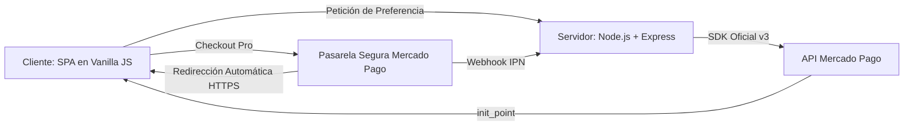

# 🎤 Guía de Exposición y Defensa Técnica — Botanika & Co.

> **Materia:** Programación IV  
> **Proyecto:** Botanika & Co. — E-commerce SPA con Pasarela Mercado Pago  
> **Equipo:** BugsBasters — 4to Trimestre  
> **Propósito:** Documento estructurado de apoyo para la exposición oral, demostración en vivo (Live Demo) y defensa técnica ante el docente o jurado evaluador.

---

## 💡 Resumen Rápido para Leer al Principio (En palabras simples)

> **Lectura directa para arrancar la presentación (30 a 45 segundos):**
>
> *"En pocas palabras, ¿qué es lo que hicimos y qué van a ver hoy?*  
>  
> 1. **Creamos la tienda:** Desarrollamos una web moderna para comprar plantas y macetas que funciona de manera instantánea, sin recargar nunca la pantalla (SPA).  
> 2. **Conectamos los pagos reales:** Le integramos la pasarela oficial de **Mercado Pago (Checkout Pro)** para que el cliente pueda pagar con tarjeta de crédito, débito o dinero en cuenta.  
> 3. **Automatizamos el regreso:** Al confirmar el pago, logramos que Mercado Pago **devuelva automáticamente y en 5 segundos** al comprador a nuestra web, sin que tenga que tocar nada.  
> 4. **Confirmamos la compra:** Nuestra tienda recibe el número de comprobante oficial de Mercado Pago (`#MP-...`), vacía el carrito y muestra la pantalla de compra exitosa.  
> 5. **Lo dejamos seguro y listo para la nube:** Todo el código quedó unificado, protegido contra filtración de claves privadas y listo para funcionar tanto en local como en internet en Vercel.  
>  
> *A continuación, les mostramos en detalle cómo está construido y la demostración en vivo."*

---

## 📑 Índice de la Presentación

1. [Resumen Rápido (En palabras simples)](#-resumen-rápido-para-leer-al-principio-en-palabras-simples)
2. [Estructura y Tiempos Sugeridos](#1-estructura-y-tiempos-sugeridos)
3. [Pitch de Apertura e Introducción](#2-pitch-de-apertura-e-introducción)
4. [Arquitectura del Sistema y Tecnologías](#3-arquitectura-del-sistema-y-tecnologías)
5. [El Desafío Técnico: Integración con Mercado Pago](#4-el-desafío-técnico-integración-con-mercado-pago)
6. [Guion de la Demostración en Vivo (Live Demo)](#5-guion-de-la-demostración-en-vivo-live-demo)
7. [Seguridad y Buenas Prácticas](#6-seguridad-y-buenas-prácticas)
8. [Banco de Preguntas Frecuentes del Jurado (Q&A)](#7-banco-de-preguntas-frecuentes-del-jurado-qa)
9. [Conclusión y Cierre](#8-conclusión-y-cierre)

---

## 1. Estructura y Tiempos Sugeridos

| Bloque | Duración | Objetivo |
| :--- | :---: | :--- |
| **0. Resumen Simple** | 30 seg | Explicar en 5 puntos sencillos qué hace el proyecto. |
| **1. Introducción** | 1 min | Presentar al equipo, el concepto de Botanika & Co. y el problema que resuelve. |
| **2. Arquitectura** | 2 min | Explicar el enfoque Full Stack: Frontend SPA + Backend Express + Serverless. |
| **3. Pasarela de Pago**| 3 min | Detallar el flujo de Checkout Pro, la creación de preferencias y la redirección automática. |
| **4. Live Demo** | 3 min | Demostrar en vivo el circuito: Catálogo ➔ Carrito ➔ Pago ➔ Redirección ➔ Éxito. |
| **5. Seguridad & Q&A** | 2-3 min | Responder preguntas del docente con fundamentos técnicos sólidos. |

---

## 2. Pitch de Apertura e Introducción

> *"Buenos días / tardes profesor y compañeros. Hoy les presentamos **Botanika & Co.**, una plataforma de comercio electrónico moderna, minimalista y responsiva orientada a la venta de plantas de interior y diseño botánico.*  
>  
> *Nuestro objetivo no fue únicamente construir una interfaz visual atractiva, sino resolver un desafío de ingeniería real: diseñar una experiencia de usuario fluida mediante una **Single Page Application (SPA)** conectada a un backend en **Node.js** con una **pasarela de pagos real y automatizada a través de Mercado Pago**."*

### Puntos clave a destacar:
* **Zero-Reload:** La aplicación no recarga nunca la página; todas las vistas cambian instantáneamente emulando una aplicación móvil nativa.
* **Diseño Biofílico y Mobile-First:** Diseñado pensando primero en teléfonos móviles y adaptado a monitores de escritorio con Tailwind CSS.

---

## 3. Arquitectura del Sistema y Tecnologías

> *"Para la arquitectura decidimos separar claramente las responsabilidades, pero manteniendo un proyecto unificado y listo para despliegue continuo:"*

### ¿Qué tecnologías elegimos y por qué?

1. **Frontend (Vanilla JavaScript ES6+ & Tailwind CSS):**
   * Elegimos **Vanilla JS** para demostrar dominio pleno del DOM, manejo de eventos y promesas asíncronas sin depender de frameworks que añadan sobrecarga innecesaria.
   * **Tailwind CSS** nos permitió definir un *Design System* consistente con una paleta personalizada (`botanika`) en tonos verde bosque, terracota y arena.

2. **Backend (Node.js con Express 5):**
   * Servidor ligero y escalable encargado de la lógica de negocio, validación de carritos y comunicación cifrada con Mercado Pago.
   * Modo dual: corre como servidor tradicional local (`http://localhost:3000`) y como función serverless en Vercel gracias a `vercel.json` y `api/index.js`.

3. **Mercado Pago SDK v3 (`@mercadopago/sdk-node`):**
   * Implementación de la versión más reciente del SDK oficial para generar objetos `Preference` y consultar transacciones con `Payment`.

---

## 4. El Desafío Técnico: Integración con Mercado Pago

> *"El punto más complejo y enriquecedor del proyecto fue lograr un flujo de pago **completamente automatizado**."*

### Explicación del circuito técnico:

1. **Creación de la Preferencia (`createPreference`):**
   * Cuando el usuario hace clic en *Pagar*, el frontend envía al backend la lista de productos, flete y datos del comprador.
   * El backend construye la orden oficial en pesos argentinos (ARS).

2. **El reto de la Redirección Automática (`auto_return`):**
   * *"Para que Mercado Pago no deje al usuario atrapado en su pantalla final y lo devuelva solo a nuestra web, se requiere la propiedad `auto_return: 'approved'`."*
   * **El obstáculo:** Mercado Pago exige estrictamente que las URLs de retorno (`back_urls`) utilicen el protocolo **`HTTPS`**. Si se le envía una URL local en `http://`, Mercado Pago descarta las URLs y desactiva la redirección.
   * **Nuestra solución:** Implementamos una lógica inteligente en el backend: normalizamos las URLs con la función `formatBackUrl` y priorizamos la URL segura con HTTPS (`CLIENT_URL` en `.env`), logrando que tras el pago, Mercado Pago **redirija automáticamente en 5 segundos** de vuelta a Botanika.

3. **Recepción en la Tienda:**
   * Al regresar a la URL de éxito, el script lee los parámetros `status=approved` y `payment_id`, asigna el número de comprobante oficial (`#MP-XXXXXXXX`), vacía el carrito y muestra la pantalla de felicitaciones.

---

## 5. Guion de la Demostración en Vivo (Live Demo)

Sigue este paso a paso exacto frente al evaluador:

| Paso | Acción en Pantalla | Qué decir mientras lo haces |
| :---: | :--- | :--- |
| **1** | Abre `http://localhost:3000` (o la URL de Vercel). | *"Aquí vemos la página principal. Noten la fluidez de la navegación. Si entro al catálogo o filtro por luz indirecta, la vista se actualiza sin recargar la página."* |
| **2** | Haz clic en una planta (ej: *Monstera Deliciosa*) y añade 1 o 2 ítems al carrito. | *"El carrito es reactivo: recalcula subtotales en tiempo real y actualiza la burbuja del header."* |
| **3** | Ve al Carrito y aplica el cupón `BOTANIKA10`. | *"Contamos con lógica de promociones. Al aplicar el cupón se descuenta el 10% automáticamente."* |
| **4** | Ve al Checkout, selecciona envío y haz clic en **Pagar con Mercado Pago**. | *"Al pulsar pagar, nuestro backend se comunica con la API de Mercado Pago y genera la preferencia de pago segura."* |
| **5** | En la pasarela de Mercado Pago, ingresa una tarjeta de prueba o saldo demo y confirma. | *"Aquí nos encontramos en el entorno seguro de Mercado Pago..."* |
| **6** | Observa el mensaje de aprobación y espera la **redirección automática**. | *"Fíjense que no hace falta tocar nada: en 5 segundos Mercado Pago nos devuelve automáticamente a Botanika."* |
| **7** | Muestra la pantalla **"¡Compra exitosa!"**. | *"El sistema detectó el pago aprobado, vació el carrito a 0 y generó el comprobante oficial con el ID de Mercado Pago."* |

---

## 6. Seguridad y Buenas Prácticas

> *"Como futuros profesionales, la seguridad fue una prioridad desde el día uno:"*

1. **Gestión de Secretos:**
   * El archivo `.env` está estrictamente aislado en `.gitignore`.
   * **Auditoría limpia:** Se auditó el historial de Git (`git log --all --full-history`) demostrando que **nunca se ha filtrado una credencial al repositorio**.
2. **Cero Tokens Hardcodeados:**
   * En ningún archivo `.js` hay claves pegadas en texto plano; todo se inyecta por variables de entorno del sistema (`process.env`).
3. **Cumplimiento PCI-DSS:**
   * Nuestra aplicación jamás toca ni almacena números de tarjeta ni códigos de seguridad. Todo el procesamiento de datos bancarios sensibles ocurre en los servidores con certificación bancaria de Mercado Pago.

---

## 7. Banco de Preguntas Frecuentes del Jurado (Q&A)

Prepárate para estas preguntas habituales de los docentes:

### ❓ P1: *"¿Por qué usaron Vanilla JavaScript en lugar de React o Angular?"*
> **Respuesta:** *"Optamos por Vanilla JS porque queríamos demostrar un entendimiento profundo de los fundamentos web: manipulación directa del DOM, gestión del historial del navegador con `replaceState`, y programación asíncrona con promesas y `fetch`. Además, al no requerir un bundle pesado, la carga de la página es casi instantánea."*

### ❓ P2: *"Si el usuario manipula la URL y escribe `?status=approved`, ¿se aprueba una compra falsa?"*
> **Respuesta:** *"En el frontend mostramos la confirmación visual de cara al usuario para una respuesta inmediata. Sin embargo, para la seguridad del negocio implementamos el endpoint de **Webhooks (`/api/payments/webhook`)**. Cuando Mercado Pago procesa el dinero, envía una notificación server-to-server en segundo plano que nosotros verificamos consultando la API con `payment.get(paymentId)`, garantizando que el pedido solo se despacha si el dinero está efectivamente acreditado."*

### ❓ P3: *"¿Por qué tuvieron que configurar HTTPS para que funcione la redirección?"*
> **Respuesta:** *"Mercado Pago establece por estándar de seguridad que la redirección automática (`auto_return`) solo es válida en entornos con certificados SSL (HTTPS). Si se utiliza `http://` plano, la API bloquea el retorno automático para evitar ataques de intermediario (Man-in-the-Middle) que intercepten al comprador."*

### ❓ P4: *"¿Cómo se despliega el backend en Vercel si es una aplicación Express?"*
> **Respuesta:** *"Aprovechamos el archivo `vercel.json` con una regla de reescritura que redirige todas las llamadas a `/api/(.*)` hacia `api/index.js`. Vercel envuelve nuestra aplicación Express dentro de una Serverless Function, lo que significa que el backend no consume recursos cuando no hay peticiones activas y escala automáticamente bajo demanda."*

---

## 8. Conclusión y Cierre

> *"En conclusión, **Botanika & Co.** representa una solución completa de comercio electrónico: combina una interfaz estética, rápida y accesible con una integración bancaria sólida y segura utilizando estándares de la industria.*  
>  
> *Agradecemos su atención y quedamos a disposición para cualquier consulta técnica o funcional. ¡Muchas gracias!"*
