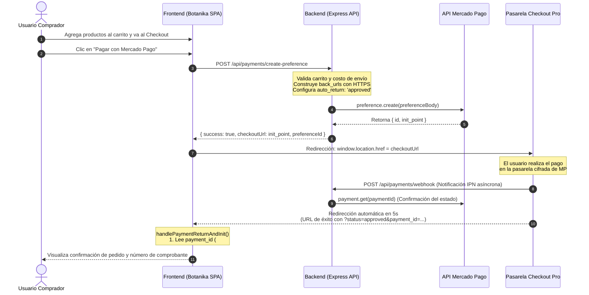

# 🌿 Botanika & Co. — Documentación Técnica de Integración con Mercado Pago & Auditoría de Seguridad

[](https://nodejs.org/)
[](https://expressjs.com/)
[](https://www.mercadopago.com.ar/developers)
[](https://vercel.com/)

> Este documento detalla la arquitectura técnica, el flujo de pagos, la configuración del entorno y el informe de auditoría de seguridad para la integración de **Mercado Pago (Checkout Pro)** en **Botanika & Co.**

---

## 📑 Tabla de Contenidos

1. [Descripción General de la Integración](#1-descripción-general-de-la-integración)
2. [Stack Tecnológico](#2-stack-tecnológico)
3. [Flujo de Trabajo y Arquitectura (Checkout Pro)](#3-flujo-de-trabajo-y-arquitectura-checkout-pro)
4. [Estructura del Proyecto](#4-estructura-del-proyecto)
5. [Instalación y Puesta en Marcha Local](#5-instalación-y-puesta-en-marcha-local)
6. [Configuración de Variables de Entorno](#6-configuración-de-variables-de-entorno)
7. [Despliegue en Producción (Vercel)](#7-despliegue-en-producción-vercel)
8. [Informe de Auditoría de Seguridad y Archivo .env](#8-informe-de-auditoría-de-seguridad-y-archivo-env)

---

## 1. Descripción General de la Integración

Botanika & Co. integra la pasarela de pagos oficial de **Mercado Pago** mediante el modelo **Checkout Pro**, permitiendo cobrar de manera segura a través de:
* Tarjetas de crédito y débito.
* Dinero disponible en cuenta de Mercado Pago.
* Puntos de pago en efectivo (Rapipago, Pago Fácil) y transferencias bancarias.

### Capacidades Implementadas:
* **Generación dinámica de preferencias:** Los ítems del carrito, fletes y datos del comprador se envían desde el frontend y son procesados por el backend en Express.
* **Redirección Automática (`auto_return: 'approved'`):** Al confirmarse el pago, Mercado Pago redirige automáticamente al comprador de regreso a la tienda sin exigir clics manuales.
* **Recepción y procesamiento de retorno:** El frontend detecta los parámetros de URL (`?status=approved&payment_id=...`), extrae el comprobante `#MP-[ID]`, vacía el carrito y muestra la pantalla de confirmación.
* **Recepción de Webhooks / Notificaciones IPN:** Endpoint server-to-server (`/api/payments/webhook`) para confirmar la acreditación de pagos de forma asíncrona.

---

## 2. Stack Tecnológico

| Capa | Tecnología | Propósito |
| :--- | :--- | :--- |
| **Frontend** | Vanilla JavaScript (ES6+), HTML5, Tailwind CSS, Lucide Icons | Interfaz de usuario SPA reactiva, carrito de compras y consumo de APIs con `fetch`. |
| **Backend** | Node.js (v18+), Express.js (v5.x) | Servidor API RESTful, enrutamiento, CORS y servidor de archivos estáticos. |
| **SDK de Pago** | `@mercadopago/sdk-node` (v3.6.1) | Cliente oficial de Mercado Pago para generar objetos `Preference` y consultar `Payment`. |
| **Configuración** | `dotenv` (v17.x) | Inyección y lectura segura de variables de entorno locales. |
| **Entorno Serverless**| Vercel Functions (`vercel.json`, `api/index.js`) | Adaptador para ejecutar la API en modo serverless en la nube. |

---

## 3. Flujo de Trabajo y Arquitectura (Checkout Pro)

### Diagrama de Secuencia



### Detalle de Endpoints del Backend

| Método | Endpoint | Descripción |
| :--- | :--- | :--- |
| `GET` | `/api/health` | Health check para verificar la disponibilidad y estado del servicio. |
| `POST`| `/api/payments/create-preference` | Crea la preferencia en Mercado Pago recibiendo ítems, flete y datos del cliente. Retorna `init_point` y `preferenceId`. |
| `POST` / `GET` | `/api/payments/webhook` | Recibe avisos IPN de Mercado Pago ante cambios en el estado de una transacción. |

---

## 4. Estructura del Proyecto

```text
Programacion-IV/Botanika/
├── .env                       # Variables de entorno con credenciales (IGNORADO EN GIT)
├── .env.example               # Plantilla pública de variables requeridas
├── index.html                 # Shell HTML y montaje del frontend SPA
├── script.js                  # Lógica del frontend, carrito, enrutador y checkout
├── styles.css                 # Estilos personalizados y resets
├── package.json               # Dependencias y scripts unificados de Node.js
├── package-lock.json          # Árbol de dependencias bloqueado
├── vercel.json                # Reescrituras serverless para despliegue en Vercel
├── README.md                  # Presentación académica del proyecto
├── MERCADOPAGO.md             # Esta documentación técnica
│
├── api/
│   └── index.js               # Adaptador para Serverless Function en Vercel
│
└── backend/
    └── src/
        ├── app.js             # Configuración de Express, middlewares y CORS
        ├── config/
        │   └── mercadopago.config.js  # Instancia y configuración del SDK de MP
        ├── controllers/
        │   └── payment.controller.js  # Controladores de la API de pagos
        ├── routes/
        │   └── payment.routes.js      # Definición de rutas del backend
        └── services/
            └── payment.service.js     # Lógica de creación de preferencias y auto_return
```

---

## 5. Instalación y Puesta en Marcha Local

### Prerrequisitos:
* **Node.js** v18 o superior ([nodejs.org](https://nodejs.org/)).
* **npm** instalado.

### Pasos:
1. Navega a la carpeta del proyecto:
   ```bash
   cd Programacion-IV/Botanika
   ```
2. Instala las dependencias:
   ```bash
   npm install
   ```
3. Genera tu archivo `.env` a partir de la plantilla:
   ```bash
   cp .env.example .env
   ```
4. Inicia el servidor de desarrollo local con recarga automática:
   ```bash
   npm run dev
   ```
   O en modo estándar:
   ```bash
   npm start
   ```
5. Abre la aplicación en tu navegador:
   * **Tienda:** [http://localhost:3000](http://localhost:3000)
   * **Health Check:** [http://localhost:3000/api/health](http://localhost:3000/api/health)

---

## 6. Configuración de Variables de Entorno

El archivo `.env` en la raíz de Botanika debe contener:

```env
# Puerto local del servidor Express
PORT=3000

# Access Token privado de Mercado Pago (Credencial Sandbox TEST-... o Producción APP_USR-...)
MP_ACCESS_TOKEN=TEST-xxxxxxxx-xxxx-xxxx-xxxx-xxxxxxxxxxxx

# Public Key de Mercado Pago
MP_PUBLIC_KEY=TEST-xxxxxxxx-xxxx-xxxx-xxxx-xxxxxxxxxxxx

# URL del Frontend para la redirección de retorno tras el pago
# NOTA: Mercado Pago exige HTTPS para habilitar la redirección automática (auto_return: 'approved').
CLIENT_URL=https://bugsbasters-cuartosemestre.vercel.app/

# URL del Backend para recibir Webhooks (opcional en desarrollo local)
# BACKEND_URL=https://bugsbasters-cuartosemestre.vercel.app
```

---

## 7. Despliegue en Producción (Vercel)

1. **Configuración de Directorio Raíz:**
   En el panel de Vercel (**Project Settings ➔ General ➔ Root Directory**), establecer:
   ```text
   Programacion-IV/Botanika
   ```
2. **Variables de Entorno en Vercel:**
   Cargar en **Project Settings ➔ Environment Variables**:
   * `MP_ACCESS_TOKEN`: Tu Access Token de Mercado Pago.
   * `MP_PUBLIC_KEY`: Tu Public Key de Mercado Pago.
   * `CLIENT_URL`: `https://bugsbasters-cuartosemestre.vercel.app/`
3. **Despliegue Automático:**
   Al hacer `git push`, Vercel ejecuta `npm install`, compila los estáticos y enruta `/api/*` hacia `api/index.js` gracias a `vercel.json`.

---

## 8. Informe de Auditoría de Seguridad y Archivo .env

Como parte de las mejores prácticas de ingeniería de software y seguridad de datos financieros, se llevó a cabo una auditoría exhaustiva sobre el repositorio:

### Matriz de Verificación de Seguridad

| Control de Seguridad | Resultado | Detalle y Evidencia |
| :--- | :---: | :--- |
| **Exposición del archivo `.env` en Git** | ✅ **APROBADO** | El comando `git ls-files --stage` confirma que ningún archivo `.env` que contenga secretos reales está rastreado en el repositorio. |
| **Historial de Commits Históricos** | ✅ **APROBADO** | La auditoría retrospectiva (`git log --all --full-history -- "**.env"`) arrojó **0 coincidencias**. Jamás se ha filtrado un archivo `.env` al historial de versiones. |
| **Configuración del `.gitignore`** | ✅ **APROBADO** | El archivo `.gitignore` raíz incluye explícitamente las reglas `.env`, `.env.local` y `node_modules/`, previniendo subidas accidentales. |
| **Escaneo de Credenciales Hardcodeadas** | ✅ **APROBADO** | Se ejecutó un análisis estático en todo el árbol de archivos JavaScript. **No existen tokens sensibles hardcodeados** (cadenas `APP_USR-` o `TEST-`). Todas las credenciales son leídas dinámicamente desde `process.env`. |
| **Plantilla Segura `.env.example`** | ✅ **APROBADO** | Contiene exclusivamente valores de referencia ficticios (`TEST-xxxxxxxx...`) para servir de guía sin comprometer la seguridad de las cuentas. |
| **Protección de Datos de Tarjetas (PCI-DSS)**| ✅ **APROBADO** | La arquitectura utiliza Checkout Pro; los datos sensibles de tarjetas son gestionados íntegramente por los servidores certificados de Mercado Pago, eliminando riesgos de almacenamiento indebido en el servidor local. |
| **Redirección Segura con HTTPS** | ✅ **APROBADO** | El backend valida y exige protocolo HTTPS antes de habilitar `auto_return`, cumpliendo con las políticas de seguridad de la API de Mercado Pago. |
