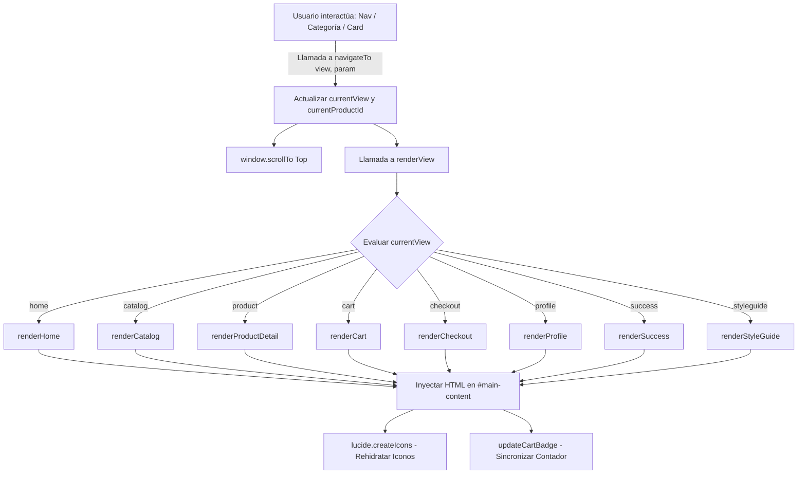

# 🌿 Botanika & Co. — E-commerce & Sistema de Diseño UI/UX

> **Proyecto de E-commerce Frontend & Sistema de Diseño**  
> **Materia:** Programación IV  
> **Equipo / Autor:** BugsBasters — 4to Trimestre  
> **Estado:** Prototipo SPA Completo y Funcional  

---

## 📑 Tabla de Contenidos
1. [Descripción General y Propósito](#-1-descripción-general-y-propósito)
2. [Estructura del Proyecto y Arquitectura](#-2-estructura-del-proyecto-y-arquitectura)
3. [Tecnologías y Librerías Utilizadas](#-3-tecnologías-y-librerías-utilizadas)
4. [Modelo de Datos y Estado Global](#-4-modelo-de-datos-y-estado-global)
5. [Arquitectura SPA y Enrutamiento](#-5-arquitectura-spa-y-enrutamiento)
6. [Módulos, Pantallas y Flujos de Usuario](#-6-módulos-pantallas-y-flujos-de-usuario)
7. [Sistema de Diseño UI/UX](#-7-sistema-de-diseño-uiux)
8. [Lógica de Negocio y Simulaciones](#-8-lógica-de-negocio-y-simulaciones)
9. [Instalación y Ejecución Local](#-9-instalación-y-ejecución-local)
10. [Guía de Defensa y Presentación Académica](#-10-guía-de-defensa-y-presentación-académica)

---

## 🌿 1. Descripción General y Propósito

**Botanika & Co.** es una aplicación web tipo **Single Page Application (SPA)** de comercio electrónico moderno y minimalista, especializada en la comercialización de plantas de interior, macetas de cerámica artesanal, sustratos premium y kits botánicos para principiantes.

### Objetivos Clave:
* **Experiencia de Usuario (UX) Fluida:** Navegación instantánea entre pantallas sin recargas de página (*zero-reload*), emulando el comportamiento de una Progressive Web App (PWA) o aplicación nativa móvil.
* **Diseño Mobile-First y Responsivo:** Adaptación precisa a dispositivos móviles, tablets y pantallas de escritorio.
* **Estética Biofílica y Cálida:** Paleta cromática natural (tonos verdes botánicos, terracota, crema y arena) combinada con tipografía refinada (Serif para encabezados e Inter para legibilidad de lectura).
* **Flujo de Conversión Completo:** Simulación integral del *User Journey* desde el descubrimiento en Home hasta la confirmación de orden y factura simulada.

---

## 📂 2. Estructura del Proyecto y Arquitectura

El proyecto está organizado de manera limpia y modular en tres capas de presentación y lógica:

```text
Botanika/
│
├── index.html       # Estructura semántica HTML5, CDNs y contenedores raíz
├── styles.css       # Estilos globales, scrollbars personalizadas y fuentes
├── script.js        # Lógica de negocio, base de datos mock, enrutador SPA y vistas
├── README.md        # Documentación principal del repositorio
└── read.md          # Documento de soporte y referencia
```

### Detalle de Responsabilidades:

| Archivo | Responsabilidad Principal |
| :--- | :--- |
| **`index.html`** | Esqueleto semántico, configuración de Tailwind CSS en tiempo de ejecución, importación de iconos vectoriales (Lucide) y montaje del shell de la aplicación (`#header`, `#main-content`, `#toast`, `#footer`). |
| **`styles.css`** | Importación de la fuente tipográfica Inter, definición del desplazamiento suave (`scroll-behavior: smooth`) y personalización estética de la barra de desplazamiento (`::-webkit-scrollbar`). |
| **`script.js`** | Núcleo del frontend en Vanilla JavaScript. Centraliza el catálogo en memoria, el estado del carrito, el enrutador reactivo, la renderización de 8 vistas dinámicas y los controladores de eventos. |

---

## 🛠️ 3. Tecnologías y Librerías Utilizadas

* **HTML5 Semántico:** Marcado accesible (`<header>`, `<main>`, `<footer>`, `<section>`, `<nav>`, `<button>`).
* **Vanilla JavaScript (ES6+):** Programación reactiva basada en templates literales (`template strings`), programación funcional (`map`, `filter`, `reduce`, `find`) y manipulación del DOM en tiempo real sin dependencias pesadas.
* **Tailwind CSS (CDN v3):** Framework de utilidades CSS configurado mediante inyección de tema con paleta personalizada de colores tierra y naturaleza.
* **Lucide Icons:** Conjunto de iconos vectoriales limpios y modernos renderizados dinámicamente (`lucide.createIcons()`).
* **Google Fonts:** Tipografía *Inter* para máxima legibilidad en textos de interfaz y componentes.
* **Unsplash API:** Imágenes de alta resolución seleccionadas específicamente para el concepto botánico.

---

## 🧠 4. Modelo de Datos y Estado Global

La aplicación maneja el estado del cliente en memoria en `script.js`:

### 4.1. Catálogo de Productos (`products`)
Array de objetos con la definición de cada producto:
```javascript
{
    id: 1,
    name: "Monstera Deliciosa",
    category: "Plantas",          // 'Plantas' | 'Macetas' | 'Sustratos' | 'Kits'
    price: 34000,                // Valor numérico en moneda local
    image: "https://...",        // URL de la imagen principal
    light: "Indirecta",          // Nivel de luz para ficha técnica
    size: "Mediana",             // Tamaño del espécimen / artículo
    pot: "Terracota",            // Material o acabado de maceta por defecto
    badge: "Más Vendido"         // Badge promocional: 'Más Vendido' | 'Nuevo' | 'Esencial' | 'Kit'
}
```

### 4.2. Carrito de Compras (`cart`)
Array reactivo que almacena los ítems seleccionados por el cliente:
```javascript
{
    id: 1,
    name: "Monstera Deliciosa",
    price: 34000,
    qty: 1,                      // Cantidad dinámica
    image: "https://...",
    pot: "Terracota Artesanal"
}
```

### 4.3. Variables de Estado Global
* `currentView`: String con el identificador de la pantalla activa (`'home'`, `'catalog'`, `'product'`, `'cart'`, `'checkout'`, `'profile'`, `'success'`, `'styleguide'`).
* `currentProductId`: Entero con el ID del producto que se está visualizando en detalle.
* `discountApplied`: Booleano que indica si el cupón de descuento del 10% fue validado y aplicado.

---

## ⚡ 5. Arquitectura SPA y Enrutamiento

La aplicación implementa una arquitectura SPA sin frameworks (como React o Vue), logrando una alta velocidad y ligereza:

### Diagrama de Flujo de Navegación



### Mecanismo de renderizado:
1. `navigateTo(view, param)`: Actualiza las variables de estado, posiciona el scroll al inicio y desencadena el render.
2. `renderView()`: Utiliza un `switch(currentView)` para evaluar qué función generadora de string HTML invocar y asignarla a `document.getElementById('main-content').innerHTML`.
3. `lucide.createIcons()`: Re-escanea el DOM generado para transformar los tags `<i data-lucide="...">` en SVGs vectoriales listos para interactuar.

---

## 🖥️ 6. Módulos, Pantallas y Flujos de Usuario

### 6.1. Home (`renderHome`)
* **Hero Section:** Mensaje de impacto visual con llamado a la acción (`Explorar Catálogo` o `Ver Destacada`) e imagen destacada con halo difuminado (*blur*).
* **Explora por Categoría:** Cuadrícula de 4 accesos rápidos (Plantas, Macetas, Sustratos, Kits) con overlays de degradado oscuro y animaciones de zoom (*hover scale*).
* **Más Vendidos & Nuevos Ingresos:** Secciones con cards de productos reutilizables.
* **Banner Academia Botanika:** Módulo educativo que ofrece una guía descargable sobre el cuidado de plantas en invierno, con interacción de confirmación vía *Toast*.

### 6.2. Catálogo General (`renderCatalog`)
* **Barra de Filtros Laterales:**
  * Filtro por categoría (checkboxes de selección múltiple).
  * Requerimientos lumínicos (mucha luz indirecta vs. semisombra).
  * Paleta interactiva de estilos de maceta (Terracota, Beige, Antracita, Blanco).
  * Botón para limpiar o aplicar filtros con respuesta instantánea.
* **Barra de Ordenamiento:** Selector por relevancia, menor precio, mayor precio y novedades.
* **Grid de Productos:** Catálogo completo organizado en grilla adaptable de 3 columnas en escritorio.

### 6.3. Ficha de Detalle de Producto (`renderProductDetail`)
* **Breadcrumb Navigation:** Migas de pan dinámicas (`Home / Catálogo / [Nombre del Producto]`).
* **Galería Interactiva:** Vista principal ampliada con miniaturas de ángulos alternativos.
* **Selector de Variantes:** Botones para seleccionar terminaciones de maceta (*Terracota Natural*, *Cerámica Blanca*, *Cerámica Gris*).
* **Ficha Técnica de Cuidados:** Tarjeta resumen con métricas visuales para Luz, Riego y Ubicación recomendada.
* **Call to Action (CTA):** Botón principal `Agregar al Carrito` y botón de añadir a lista de deseos (Wishlist).
* **Productos Relacionados:** Carrusel/grilla complementaria de recomendaciones.

### 6.4. Carrito de Compras (`renderCart`)
* **Manejo de Estado Vacío:** Mensaje ilustrado con icono y botón de redirección si no hay productos.
* **Listado de Ítems:** Visualización de foto, nombre, tipo de maceta y precio unitario.
* **Controles de Cantidad:** Botones interactivos (`+` y `-`) que recalculan subtotales al instante y eliminan el ítem al llegar a 0.
* **Eliminación Rápida:** Botón de papelera para suprimir ítems individualmente.
* **Caja de Descuento:** Campo de texto interactivo. Al ingresar el cupón **`BOTANIKA10`**, aplica un 10% de descuento directo sobre el subtotal.
* **Cálculo de Envíos:** Suma automática de costos de flete logístico ($3,500).

### 6.5. Checkout (`renderCheckout`)
* **Formulario de Envío:** Captura de datos personales (Nombre, Apellido, Dirección, Ciudad, Código Postal).
* **Selección de Logística:** Radio buttons interactivos entre *Envío Protegido Especial Botanika* ($3,500) y *Retiro gratuito en Studio Palermo*.
* **Métodos de Pago:** Selector de pestañas para *Tarjeta de Crédito/Débito*, *Mercado Pago* o *Transferencia bancaria*, con inputs de tarjeta formateados.
* **Resumen y Cierre de Orden:** Botón de confirmación que limpia el carrito y dirige a la pantalla de éxito.

### 6.6. Confirmación de Compra (`renderSuccess`)
* Icono animado de éxito, felicitación personalizada y número de tracking de orden simulado (`#BOT-84920`).
* Botón de retorno al inicio para continuar la navegación.

### 6.7. Perfil y Mi Cuenta (`renderProfile`)
* Datos de usuario autenticado (Lucía Fernández).
* Historial de órdenes de compra con badges de estado (`Entregado`).
* Libreta de direcciones guardadas con opción de edición.
* Lista de deseos (*Wishlist*) con botón de adición directa al carrito.

### 6.8. Guía de Estilos / Design System (`renderStyleGuide`)
* Sección técnica orientada a desarrolladores y diseñadores:
  * Desglose de colores con muestras visuales y códigos HEX.
  * Jerarquía de tipografías y escalas (`H1`, `H2`, texto corrido).
  * Biblioteca de componentes atómicos: variantes de botones, badges y controles de formulario.

---

## 🎨 7. Sistema de Diseño UI/UX

El diseño sigue una filosofía biofílica, orgánica y minimalista.

### 7.1. Paleta de Colores

| Token Tailwind | Código HEX | Rol en el Sistema |
| :--- | :--- | :--- |
| `botanika-50` | `#F7F6F2` | Fondo general de la aplicación (blanco cálido papel) |
| `botanika-100` | `#EFECE6` | Fondos de tarjetas, headers y footers |
| `botanika-200` | `#DED8CC` | Bordes suaves, divisores y badges neutros |
| `botanika-300` | `#C7BDAB` | Bordes activos y estados de hover |
| `botanika-600` | `#526E5D` | Verde Principal / Acento Botánico / Botones primarios |
| `botanika-700` | `#3D5245` | Textos secundarios y botones con hover |
| `botanika-800` | `#2A3830` | Verde Oscuro Profundo / Textos principales y títulos |
| `botanika-terracota` | `#D07A58` | Acento cálido / Badges de oferta y descuentos |
| `botanika-sand` | `#E6DFD5` | Muestras de material y fondos de contraste |

### 7.2. Tipografía y Jerarquía
* **Títulos y Branding:** `font-serif` (Playfair / Georgia / Serif elegante) para otorgar sofisticación editorial.
* **Interfaz y Textos:** `font-sans` (*Inter*), optimizada para pantallas con pesos `300`, `400`, `500`, `600` y `700`.

### 7.3. Micro-interacciones y Accesibilidad
* **Notificaciones Flotantes (Toast):** Alertas no intrusivas en la esquina inferior derecha con animación CSS de entrada y salida (`translate-y-20`, `opacity-0`).
* **Hover States:** Escala suave en imágenes (`transform hover:scale-105 duration-500`) y transiciones en botones.
* **Scroll Suave:** Configuración nativa CSS para transiciones elegantes entre anclas y cambios de vista.

---

## 💡 8. Lógica de Negocio y Simulaciones

graph LR
    subgraph Carrito
        A[Ítems en cart] --> B[Calcular Subtotal]
        B --> C{Cupón aplicado?}
        C -->|BOTANIKA10| D[Descontar 10%]
        C -->|No| E[Descuento = $0]
        D --> F[Sumar Envío $3,500]
        E --> F
        F --> G[Total Final]
    end
    G --> H[Checkout]
    H -->|Pagar| I[Vaciar Carrito cart = []]
    I --> J[Generar Orden #BOT-84920]


### Funciones Principales:
* `addToCart(id)`: Busca el producto por ID, incrementa la cantidad si ya existía en el carrito o lo añade como nuevo elemento; actualiza el badge numérico y dispara un toast informativo.
* `updateQty(index, change)`: Modifica la cantidad de un ítem; si el total alcanza `0`, lo remueve del array mediante `splice()`.
* `applyDiscount()`: Valida el input contra la clave fija `BOTANIKA10`. Si coincide, activa `discountApplied = true` y recalcula la vista.
* `updateCartBadge()`: Realiza un `reduce()` sobre las cantidades (`qty`) del carrito para actualizar en tiempo real la burbuja de la barra superior.

---

## 🚀 9. Instalación y Ejecución Local

Al ser un proyecto frontend puro, no requiere compiladores, Node.js ni pasos de *build*:

### Método 1: Apertura directa
1. Descarga o clona el repositorio:
   ```bash
   git clone https://github.com/BrianVargas2001/BugsBasters-CuartoTrimestre.git
   ```
2. Navega a la carpeta:
   ```bash
   cd BugsBaster-4to/Programacion-IV/Botanika
   ```
3. Haz doble clic en `index.html` o ábrelo en tu navegador favorito (Chrome, Firefox, Edge, Safari).

### Método 2: Servidor local (Recomendado para Live Reload)
* **Con VS Code / Antigravity IDE:** Instala la extensión **Live Server**, haz clic derecho en `index.html` y selecciona **"Open with Live Server"**.
* **Con Python:**
  ```bash
  python -m http.server 8000
  ```
  Luego accede a `http://localhost:8000`.

---

## 🎓 10. Guía de Defensa y Presentación Académica

Para exposiciones, presentaciones finales o revisiones de código, se sugiere seguir este orden de demostración:

1. **Apertura:** Explicar el enfoque del negocio y la selección de la paleta de colores natural inspirada en la botánica urbana.
2. **Arquitectura:** Destacar la decisión de implementar una SPA con Vanilla JS, demostrando la fluidez de navegación entre secciones sin parpadeos ni recargas.
3. **Flujo de Usuario (Live Demo):**
   * Comenzar en la **Home**, entrar a la ficha de la *Monstera Deliciosa*.
   * Probar el cambio de maceta y añadirla al carrito.
   * Abrir el **Carrito**, cambiar las cantidades y aplicar el cupón **`BOTANIKA10`** para mostrar el cálculo reactivo.
   * Avanzar al **Checkout**, mostrar los métodos de pago y finalizar la compra para ver la pantalla de **Éxito**.
4. **Design System:** Ingresar a la **Guía de Estilos** para demostrar cómo se diseñaron los componentes reutilizables y la coherencia visual del proyecto.

---

<p align="center">
  Hecho con 🌿 por el equipo <b>BugsBasters</b> — <i>Programación IV (2026)</i>
</p>
